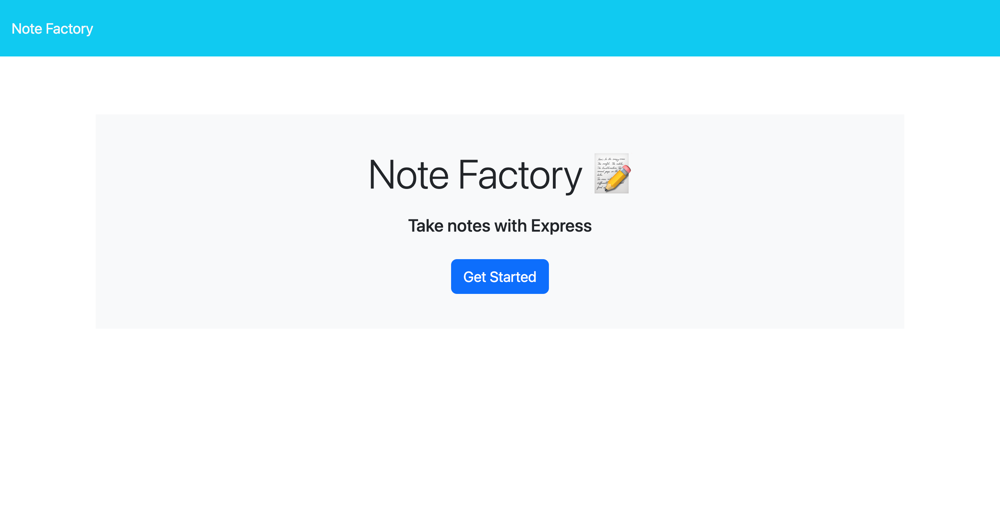
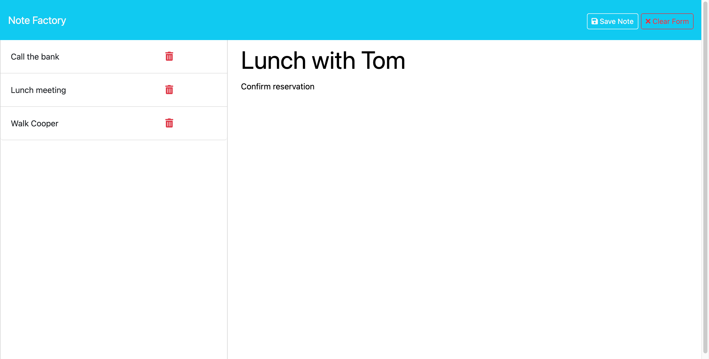
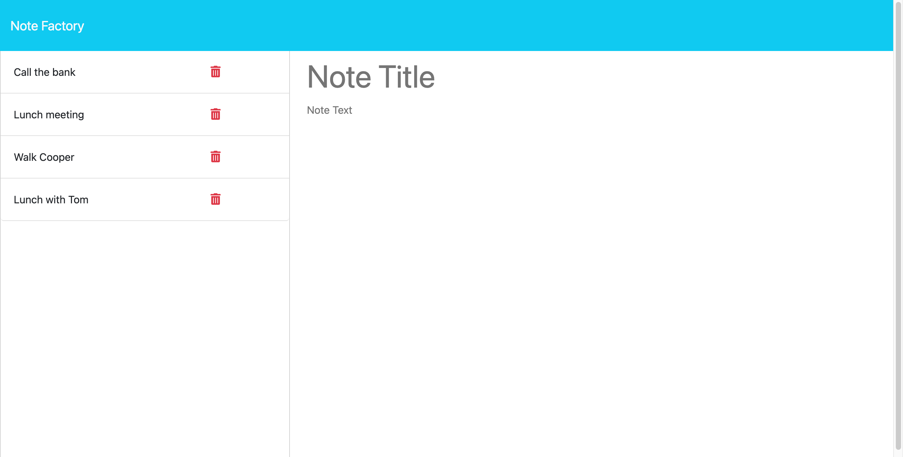

# Note Factory

## Description
    
The Note Factory is a full-stack note taking application that allows users to write, save, view, and delete notes. It was built using JavaScript, Node.js, and Express on the backend and HTML, CSS, and BootStrap for basic styling on the frontend.

On the main notes page, the left sidebar displays a scrollable list of saved note titles. When a note title is clicked, the full note text is displayed in a readable format in the right text area. Users can enter new notes or modify existing notes using this text area as well.

This project demonstrates a straight-forward yet fully capable note taking web application built on Node.js and Express. The use of server-side data persistence ensures a seamless user experience for writing and managing personal notes.
    
## Table of Contents

- [Usage](#usage)
- [Credits](#credits)
- [Questions](#questions)
- [License](#license)

## Usage

The Note Factory provides a simple interface for managing personal notes.

Home Page:

- The "Get Started" button links to the main Notes page to start taking notes.
- If a path is entered that doesn't map to an existing page or route, the home page will be displayed.

Notes Page:

- To create a new note, click the "New Note" button to clear the text area.
- Enter a title and body text, then click the "Save Note" icon to store it in the sidebar.
- To display an existing note, click its title in the left sidebar. The full note text will load into the text area.
- To remove a note, click the red trash icon next to its title in the sidebar.

The following images demonstrate the application's appearance and functionality:

## Credits

This project was created for educational purposes as part of the KU Coding Bootcamp curriculum.

The following resources were utilized:

- KU Coding Bootcamp Spot:
    - Provided project requirements and guidelines.
- W3Schools:
    - Reference for general documentation.
- MDN Web Docs:
    - Referenced for general documentation.
- Stack Overflow:
    - Referenced for general documentation.
- NPM:
    - [NPM](https://npmjs.com)
- GitHub:
    - coding-boot-camp:
        - [miniature-eureka](https://github.com/coding-boot-camp/miniature-eureka)
- Insomnia:
    - [docs.insomnia.rest](https://docs.insomnia.rest)
- Express:
    - [Express API Reference](https://expressjs.com/en/5x/api.html)
- Heroku:
    - [Heroku CLI Commands](https://devcenter.heroku.com/articles/heroku-cli-commands)
- UUID:
    - [UUID Package](https://www.npmjs.com/package/uuid)

## Questions

For any questions, feel free to email me ([joem3847@gmail.com](mailto:joem3847@gmail.com)) or visit my GitHub profile ([jmlouf](https://github.com/jmlouf/)).

## License

This project is available under the following license: MIT. For more information on rights and limitations, please review the [LICENSE](./LICENSE) file.